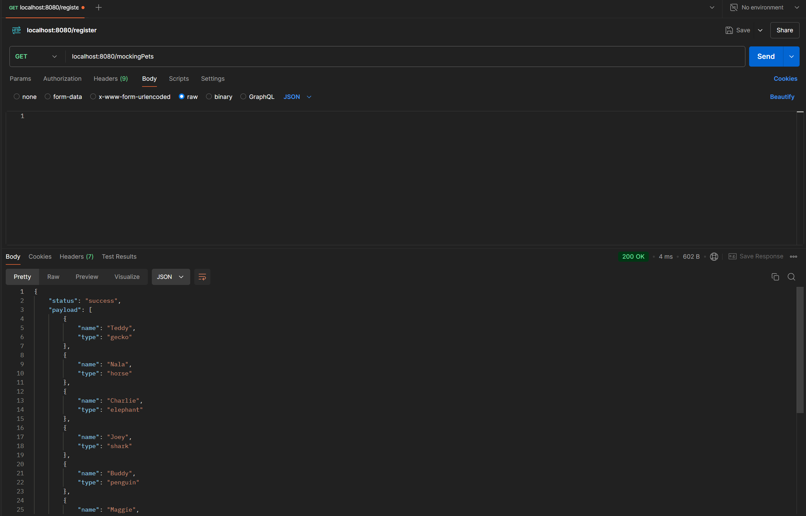

# Node.js Mocking API Project

#### `dev ~ Joey Alvarado`

## Description

This project is a backend API developed with Node.js, Express, and MongoDB. The API includes a mocking module to generate fake users and pets, as well as endpoints to insert this data into the database and verify it through queries.

## Table of Contents

1. Installation
2. Usage
3. API Endpoints
   - Mocking Users
   - Mocking Pets
4. Database
5. Technologies
6. Contact
7. Contributions
8. License

<br>

## Installation

1. Clone the repository:

```bash
git clone https://github.com/jalvaradoz/backEndIII.git
```

2. Navigate to the project directory:

```bash
cd project
```

3. Install dependencies:

```bash
npm install
```

4. Create a .env file in the root directory with your MongoDB configuration:

```bash
MONGO_URL=mongodb+srv://<username>:<password>@<cluster>.mongodb.net/<database-name>?retryWrites=true&w=majority
```

## Usage

1. Start the server

```bash
npm start
```

2. The server will be running on port 8080. You can change the port in the app.js file if needed.

## API Endpoints

### Mocking Users

- Generate 50 fake users

```bash
GET /mockingUsers
```


### Mocking Pets

- Generate 10 fake pets

```bash
GET /mockingPets
```



### Insert Data into the Database

- Create user and pet records

```bash
POST /generateData
```


- Body Parameters:

  - users: Number of users to generate.
  - pets: Number of pets to generate.

#### Example Request Body:

```json
{
  "users": 10,
  "pets": 20
}
```

#### Verify Inserted Users

```bash
GET /users
```


#### Verify Inserted Pets

```bash
GET /pets
```


## Database

The database used is MongoDB, connected via Mongoose. It includes collections for users and pets, with schemas designed to reflect data generated by the mocking module.


## Technologies

[](https://skillicons.dev)

## Contact

<p align="center">
  <a href="https://github.com/jalvaradoz">
    
  </a>
  <a href="https://www.linkedin.com/in/joey-alvarado-741a36180/">
    
  </a>
  <a href="https://joeyalvarado.netlify.app/">
    
  </a>
</p>

## Contributions

If you want to contribute to this project, please fork the repository and create a pull request.

## License

#### This project is licensed under the MIT License.
